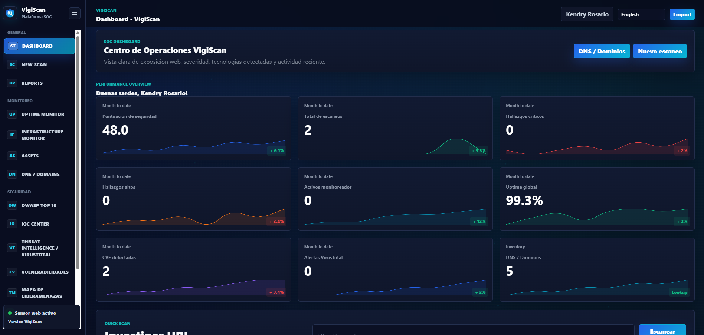
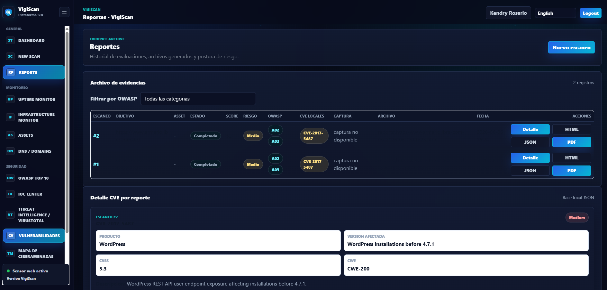
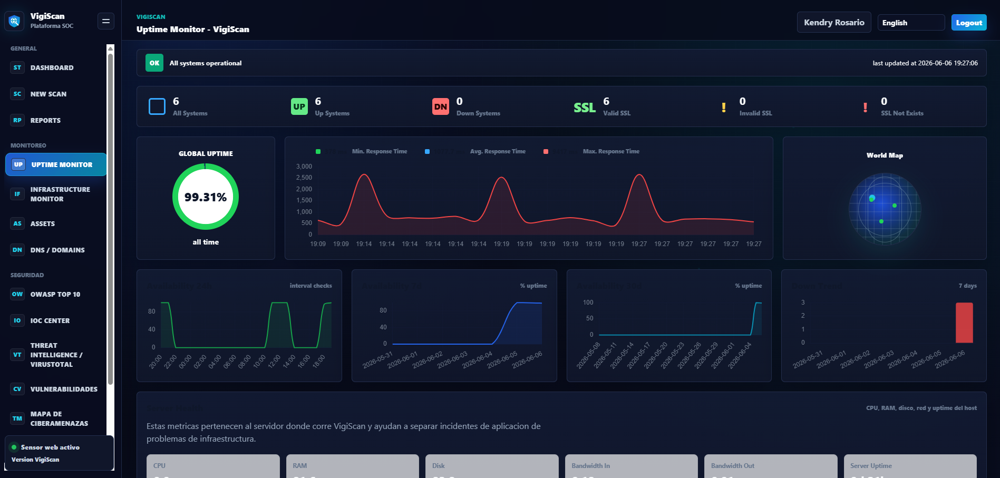
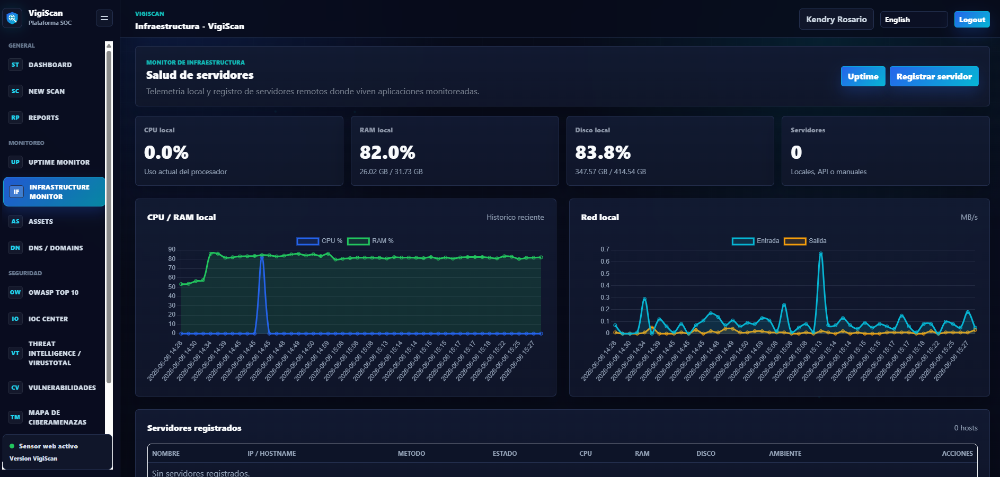

# VigiScan

**Plataforma defensiva para analisis de seguridad web, monitoreo de disponibilidad, gestion de activos, IOC Center, VirusTotal, OWASP Top 10, reportes ejecutivos y monitoreo de infraestructura.**

Desarrollado por **Kendry Rosario**.

VigiScan integra una CLI en Python y un dashboard Flask para apoyar tareas defensivas de inventario, evaluacion, monitoreo y reporte. Esta pensado para equipos SOC, NOC, AppSec, DevSecOps y administradores que necesitan una vista centralizada de la postura de seguridad web.

> Aviso legal: usa VigiScan solo sobre sistemas propios o donde tengas autorizacion explicita. La herramienta esta orientada a evaluacion defensiva, inventario y monitoreo.

## Caracteristicas principales

- Dashboard SOC moderno.
- Escaneo web defensivo HTTP/HTTPS.
- Clasificacion OWASP Top 10.
- Enriquecimiento CVE local.
- Spider seguro y acotado.
- Passive Scan.
- Uptime Monitor.
- Infrastructure Monitor local y remoto.
- Gestion de Assets.
- IOC Center.
- Integracion VirusTotal.
- Reportes HTML/PDF ejecutivos.
- Multiidioma ES/EN.

## Capturas

### Dashboard SOC



### Reportes



### Uptime Monitor



### Infrastructure Monitor



## Instalacion en Linux Ubuntu 24.04 / 26.04

Actualiza el sistema e instala dependencias base:

```bash
sudo apt update && sudo apt upgrade -y
sudo apt install git python3 python3-pip python3-venv -y
```

Clona el repositorio:

```bash
git clone https://github.com/nexhost/VigiScan.git
cd VigiScan
```

Crea y activa el entorno virtual:

```bash
python3 -m venv .venv
source .venv/bin/activate
```

Instala VigiScan:

```bash
pip install -e .
```

Instala soporte PDF opcional:

```bash
pip install -e ".[pdf]"
```

Ejecuta el dashboard:

```bash
vigiscan-web
```

Abre:

```text
http://127.0.0.1:5000
```

## Uso CLI

Ejecuta un analisis defensivo desde terminal:

```bash
vigiscan --url https://example.com --report html
```

Formatos soportados:

- `html`
- `json`
- `txt`
- `all`

Ejemplo con carpeta de salida:

```bash
vigiscan --url https://example.com --report all --output reports
```

## Uso Dashboard

Tambien puedes ejecutar Flask directamente para exponer el dashboard en red:

```bash
flask --app vigiscan.web.app run --host=0.0.0.0 --port=5000
```

Variables utiles:

```bash
export VIGISCAN_WEB_HOST=0.0.0.0
export VIGISCAN_WEB_PORT=5000
export VIGISCAN_SECRET_KEY="change-me"
```

## Credenciales iniciales

- Usuario: `admin`
- Contrasena: `admin`

Cambia la contrasena desde **Configuracion** despues del primer acceso.

## Actualizacion desde GitHub

```bash
git pull origin main
source .venv/bin/activate
pip install -e .
```

Si usas reportes PDF:

```bash
pip install -e ".[pdf]"
```

Ejecuta pruebas:

```bash
python -m pytest
```

## Modulos del sistema

### Dashboard SOC

Vista central para revisar puntuacion de seguridad, hallazgos, CVE, OWASP, disponibilidad, infraestructura, activos e inteligencia de amenazas.

### Escaneo web defensivo

Ejecuta solicitudes HTTP/HTTPS controladas para recolectar cabeceras, estado de respuesta, tecnologias y senales de exposicion sin realizar explotacion ofensiva.

### OWASP Top 10

Clasifica hallazgos tecnicos en categorias OWASP para facilitar priorizacion y comunicacion ejecutiva.

### CVE local

Consulta una base local en `data/cve_local.json` para relacionar tecnologias detectadas con vulnerabilidades conocidas.

### Spider seguro

Realiza descubrimiento limitado de URLs dentro del alcance configurado, con profundidad controlada.

### Passive Scan

Analiza senales pasivas como cabeceras, cookies, configuraciones visibles y metadatos HTTP.

### Uptime Monitor

Monitorea disponibilidad, estado HTTP, SSL, tiempo de respuesta, criticidad, responsable y ambiente de aplicaciones.

### Infrastructure Monitor

Mide CPU, RAM, disco, red, procesos y uptime del host local. Tambien permite registrar servidores remotos por metodo Local, Agent/API o Manual.

### Assets

Inventario de dominios, IPs, URLs, aplicaciones, tecnologias, criticidad, pais, estado y servidor asociado.

### IOC Center

Gestiona indicadores de compromiso con severidad, fuente, campana, TLP, etiquetas, pais relacionado y exportacion CSV/JSON.

### VirusTotal

Permite consultar reputacion de URLs, dominios, IPs o hashes usando API key cifrada y cache local.

### DNS / Dominios

Consulta registros DNS y datos WHOIS/RDAP cuando estan disponibles.

### Threat Map

Muestra una vista SOC de ciberamenazas con fuente externa configurable o visualizacion demostrativa local.

### Reportes HTML/PDF

Genera evidencias HTML/JSON/CSV y reportes PDF ejecutivos con logo, resumen, graficos, hallazgos, OWASP, CVE y plan de remediacion.

### Multiidioma ES/EN

La interfaz inicia en espanol y permite cambiar entre Espanol e Ingles desde el selector del dashboard.

## Reportes ejecutivos PDF

Instala el extra:

```bash
pip install -e ".[pdf]"
```

Los PDF se descargan desde el dashboard, detalle de escaneo o reportes. Se guardan en:

```text
reports/pdf/
```

El reporte incluye:

- Logo VigiScan.
- Informe Ejecutivo de Seguridad Web.
- URL objetivo.
- Organizacion, pais y zona horaria.
- Risk Score.
- Graficos ejecutivos.
- Detalle tecnico.
- CVE y OWASP.
- Plan de remediacion.
- Footer: `VigiScan | Desarrollado por Kendry Rosario`.

## Estructura del proyecto

```text
vigiscan/
|-- cli.py
|-- scanner.py
|-- report.py
|-- modules/
|-- data/
|-- docs/
|   `-- screenshots/
|-- vigiscan/
|   |-- modules/
|   `-- web/
|       |-- app.py
|       |-- models.py
|       |-- routes.py
|       |-- forms.py
|       |-- templates/
|       `-- static/
|-- reports/
`-- tests/
```

## Desarrollo

Instala dependencias de desarrollo:

```bash
pip install -e ".[dev]"
```

Ejecuta pruebas:

```bash
python -m pytest
```

Ejecuta lint:

```bash
ruff check .
```

## Roadmap

- Wazuh.
- OpenCTI.
- MISP.
- Shodan.
- AbuseIPDB.
- PDF avanzado.
- Alertas.

## Licencia

Consulta [LICENSE](LICENSE).
